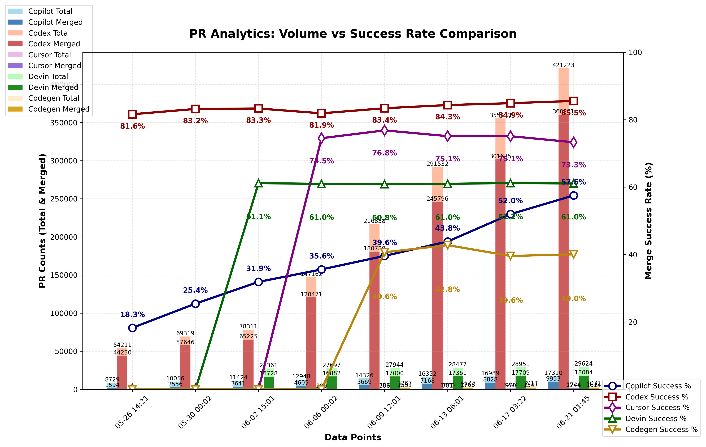

### PR Analytics: Volume vs Success Rate (auto‑updated)

View the [interactive dashboard](https://aavetis.github.io/ai-pr-watcher/) for these statistics.

## Data sources

Explore the GitHub search queries used:

- **All Copilot PRs**: [is:pr head:copilot/](https://github.com/search?q=is:pr+head:copilot/&type=pullrequests)
- **Merged Copilot PRs**: [is:pr head:copilot/ is:merged](https://github.com/search?q=is:pr+head:copilot/+is:merged&type=pullrequests)
- **All Codex PRs**: [is:pr head:codex/](https://github.com/search?q=is:pr+head:codex/&type=pullrequests)
- **Merged Codex PRs**: [is:pr head:codex/ is:merged](https://github.com/search?q=is:pr+head:codex/+is:merged&type=pullrequests)
- **All Cursor PRs**: [is:pr head:cursor/](https://github.com/search?q=is:pr+head:cursor/&type=pullrequests)
- **Merged Cursor PRs**: [is:pr head:cursor/ is:merged](https://github.com/search?q=is:pr+head:cursor/+is:merged&type=pullrequests)
- **All Devin PRs**: [author:devin-ai-integration[bot]](https://github.com/search?q=author:devin-ai-integration[bot]&type=pullrequests)
- **Merged Devin PRs**: [author:devin-ai-integration[bot] is:merged](https://github.com/search?q=author:devin-ai-integration[bot]+is:merged&type=pullrequests)

## Testing

Run comprehensive tests to verify the complete data flow works properly:

```bash
python test_pr_tracker.py
```

The tests verify the critical data flow capabilities:

**Core Data Collection:**
- Data collection from GitHub API with proper CSV storage
- Handling of API responses and error cases

**README Updates:**  
- Markdown table updates with latest metrics
- Percentage calculations including edge cases (zero division)

**Chart Generation:**
- Chart creation and PNG file generation 
- Data visualization processing

**GitHub Pages Updates:**
- JSON metrics export for interactive charts
- HTML table updates with latest statistics
- Timestamp updates for last refresh

These tests ensure that data flows properly through the entire system: Collection → CSV → Chart → README → GitHub Pages. The tests use temporary files and mock API calls to avoid side effects while testing the actual data processing logic.

---



## Current Statistics

| Project | Total PRs | Merged PRs | Merge Rate |
| ------- | --------- | ---------- | ---------- |
| Copilot | 13,960 | 5,330 | 38.18% |
| Codex   | 199,786 | 165,861 | 83.02% |
| Cursor  | 668 | 508 | 76.05% |
| Devin   | 27,857 | 16,946 | 60.83% |